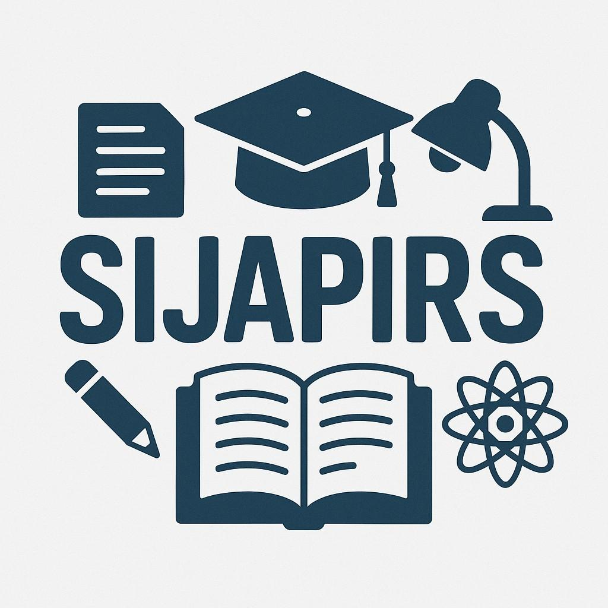

# si-japirs

Si-JAPIRS - AI Academic Assistant

Platform AI komprehensif untuk membantu mahasiswa dan dosen dalam penulisan akademik, riset, analisis data, dan presentasi.



## 🚀 Fitur Utama

### ✅ Fitur yang Sudah Diimplementasikan

1. **🏠 Landing Page**
   - Hero section dengan animasi
   - Showcase fitur-fitur utama
   - Testimonials dan statistik
   - Call-to-action sections

2. **🔐 Autentikasi**
   - Google OAuth integration
   - Session management dengan NextAuth
   - Protected routes

3. **📊 Dashboard**
   - Ringkasan aktivitas pengguna
   - Quick actions untuk akses cepat
   - Statistik penggunaan
   - Upcoming tasks dan recent activity

4. **✍️ AI Writer (Penulis Akademik)**
   - Generate outline otomatis
   - Generate draft per bagian
   - Grammar check & paraphrase
   - Export ke DOCX/PDF
   - Support multiple citation styles (APA, MLA, IEEE, etc.)

5. **💬 AI Consultation Chat**
   - 3 mode chat: General, ELI5, Academic
   - Real-time streaming responses
   - Chat history
   - Suggested questions
   - Copy & regenerate responses

6. **🔍 Research Helper**
   - Integrasi Google Scholar API
   - Advanced search filters
   - Auto-generate citations
   - Save & manage references
   - Export citations in multiple formats

### 🚧 Fitur dalam Pengembangan

7. **PDF Summarizer**
   - Upload & extract PDF content
   - Generate summaries
   - Q&A chat with documents

8. **📊 Presentation Generator**
   - Convert documents to slides
   - Auto-generate visualizations
   - Export to PPTX

9. **✅ Plagiarism Checker**
   - Similarity detection
   - Revision suggestions

10. **📈 Statistics & Data Analysis**
    - Upload CSV/Excel
    - Statistical analysis
    - Auto-generate charts

## 🛠️ Tech Stack

- **Framework**: Next.js 15 (App Router)
- **Language**: TypeScript
- **Styling**: TailwindCSS + shadcn/ui
- **Database**: PostgreSQL (Prisma ORM)
- **Storage**: Supabase
- **Authentication**: NextAuth.js + Google OAuth
- **AI Integration**: 
  - Sumopod API (GPT-4.1-nano)
  - Google Scholar API (SerpAPI)
- **Animations**: Framer Motion
- **Icons**: Lucide React + React Icons

## 📋 Prerequisites

- Node.js 18+ 
- npm or yarn
- PostgreSQL database (or Supabase account)
- Google OAuth credentials
- Sumopod API key
- SerpAPI key (for Scholar search)

## 🔧 Installation

1. **Clone atau extract project**
```bash
cd si-japir
```

2. **Install dependencies**
```bash
npm install
```

3. **Setup environment variables**

Copy `.env.local` dan sesuaikan dengan credentials Anda:

```env
# Database
DATABASE_URL="postgresql://..."

# NextAuth
NEXTAUTH_URL=http://localhost:3000
NEXTAUTH_SECRET=generate_secret_here

# Google OAuth
GOOGLE_CLIENT_ID=your_google_client_id
GOOGLE_CLIENT_SECRET=your_google_client_secret

# Supabase
NEXT_PUBLIC_SUPABASE_URL=your_supabase_url
NEXT_PUBLIC_SUPABASE_ANON_KEY=your_supabase_anon_key
SUPABASE_SERVICE_ROLE_KEY=your_service_role_key

# AI APIs
GPT_API_KEY=your_sumopod_api_key
GPT_API_URL=https://ai.sumopod.com/v1
GPT_MODEL=gpt-4.1-nano

# Scholar API
SCHOLAR_API_KEY=your_serpapi_key
SCHOLAR_API_URL=https://serpapi.com/search
```

4. **Setup database dengan Prisma**
```bash
npx prisma generate
npx prisma db push
```

5. **Run development server**
```bash
npm run dev
```

Buka [http://localhost:3000](http://localhost:3000) di browser.

## 🚀 Deployment

### Deploy ke Vercel

1. Push code ke GitHub
2. Import project di Vercel
3. Set environment variables
4. Deploy!

### Deploy ke platform lain

Project ini dapat di-deploy ke:
- Railway
- Render
- Fly.io
- Netlify (dengan adapter)
- Docker container

## 📁 Project Structure

```
si-japir/
├── app/                # Next.js app router pages
│   ├── api/           # API routes
│   ├── auth/          # Authentication pages
│   ├── dashboard/     # Dashboard page
│   ├── writer/        # AI Writer module
│   ├── consult/       # Chat consultation
│   ├── research/      # Research helper
│   └── ...
├── components/        # React components
│   └── ui/           # shadcn/ui components
├── lib/              # Utility functions
│   ├── ai-client.ts  # AI integration
│   ├── scholar.ts    # Scholar API
│   ├── prisma.ts     # Database client
│   └── ...
├── prisma/           # Database schema
├── public/           # Static assets
└── ...
```

## 🔑 Environment Variables Explained

### Required
- `DATABASE_URL`: PostgreSQL connection string
- `NEXTAUTH_SECRET`: Random secret for NextAuth (generate with `openssl rand -base64 32`)
- `GOOGLE_CLIENT_ID` & `GOOGLE_CLIENT_SECRET`: From Google Cloud Console

### AI Integration
- `GPT_API_KEY`: Sumopod API key
- `SCHOLAR_API_KEY`: SerpAPI key for Google Scholar

### Storage
- Supabase keys for file storage

## 🐛 Troubleshooting

### Database connection issues
- Pastikan PostgreSQL running
- Check DATABASE_URL format
- Run `npx prisma db push`

### Authentication tidak bekerja
- Verify Google OAuth credentials
- Check NEXTAUTH_URL matches your domain
- Ensure callback URLs configured in Google Console

### AI features tidak responsive
- Check API keys valid
- Verify API endpoints accessible
- Monitor rate limits

## 📝 Development Notes

### Adding new features
1. Create page in `app/` directory
2. Add API route if needed
3. Update navigation
4. Add to feature list

### Database changes
1. Update `prisma/schema.prisma`
2. Run `npx prisma generate`
3. Run `npx prisma db push`

## 🤝 Contributing

Contributions welcome! Please:
1. Fork the repo
2. Create feature branch
3. Commit changes
4. Push to branch
5. Open Pull Request

## 📄 License

MIT License - feel free to use for personal or commercial projects.

## 🙏 Credits

- Logo: Si-JAPIRS mascot (shark with graduation cap)
- UI Components: shadcn/ui
- AI: Sumopod (GPT-4.1-nano)
- Icons: Lucide React

## 📞 Support

For issues or questions:
- Open GitHub issue
- Contact: support@si-japir.com

---

**Made with ❤️ for Indonesian students and educators**
